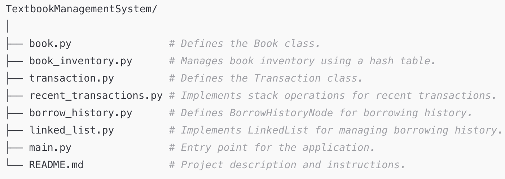

# TextbookManagementSystem

**Project Description**
The Textbook Management System is a Python-based application designed to help libraries, academic institutions, or bookstores manage their inventory of textbooks.

The system provides functionalities for:

- Adding, retrieving, and updating book information.
- Tracking recent transactions (borrowing and returning books).
- Maintaining borrowing history for each textbook.

This proof of concept demonstrates the core operations of the system, including efficient book management using data structures like hash tables, stacks, and linked lists.

**Features**

- Hash Table: Stores and retrieves book information efficiently by ISBN.
- Stack: Tracks recent borrowing and returning transactions.
- Linked List: Maintains a chronological history of book borrowing.

**How to Run the Code**

1. Clone or Download the Repository:
   git clone https://github.com/kchemutai/TextbookManagementSystem.git
   cd TextbookManagementSystem
2. Ensure Python is Installed: Ensure you have Python 3.x installed on your system. You can check by running:

   python --version

3. Run the Main File: Execute the main.py file to test the application's core functionality: python main.py
4. Expected Output: The script will demonstrate:
   - Adding books to the inventory.
   - Borrowing and returning books.
   - Viewing recent transactions.

**Project Structure**

**License**
This project is licensed under Kevin Chemutai License. See LICENSE for more information.
